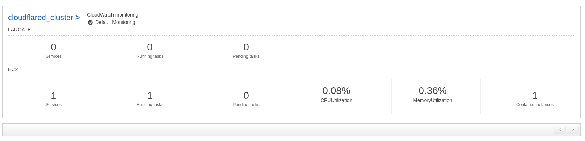
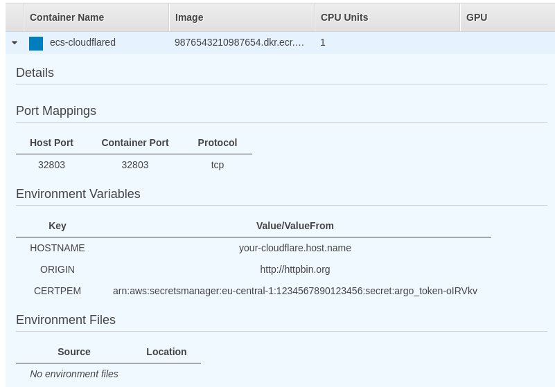
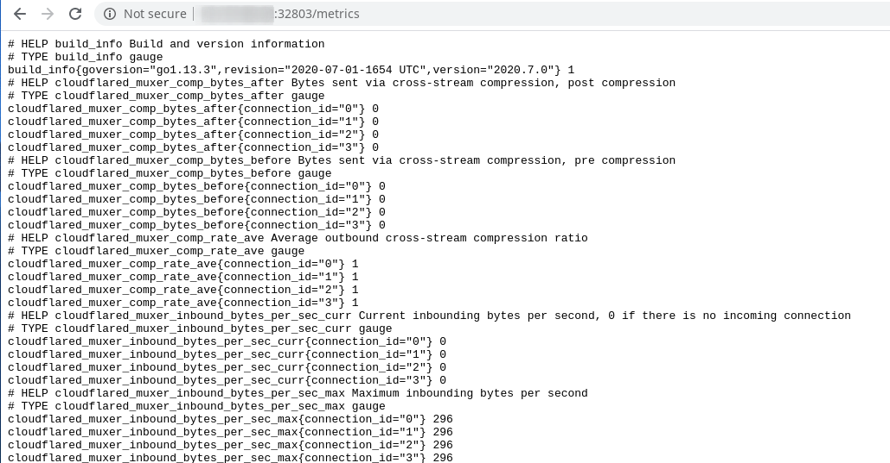

# Cloudflare Argo Tunnel - AWS Elastic Container Service - Terraform PoC
This is a proof-of-concept for running Cloudflare Argo tunnel (cloudflared) in AWS. Don't use this in production as some IAM policies might be too broad for your environment!

Assumptions:
- cloudflared will be deployed to Elastic Container Service (ECS) on EC2 instances
- the Argo Tunnel Token (cert.pem) will be stored in AWS Secrets Manager
- cloudflared will be used a a forwarding proxy to HTTPBin (the origin is configurable via `variables.tf`)
- you have a AWS subscription - this PoC used the AWS free-tier
- your AWS region is eu-central-1 - furthermore we are going to use eu-central-1c as availability zone (configurable via `variables.tf`)

## The cloudflared Docker Image
Cloudflare maintains a public Docker image for cloudflared - the Daemon that runs Cloudflare Argo Tunnel. Since we are going to
pull cert.pem from AWS Secrets Manager and the only way to do that is by passing an environment variable to our container, we are
going to use a bash capability called `process substitution`. The cloudflare Docker image doesn't ship bash, so we have to
use a custom Dockerfile:

```Dockerfile
FROM cloudflare/cloudflared
FROM debian:latest
COPY --from=0 /usr/local/bin/cloudflared /bin/cloudflared

ENTRYPOINT ["/bin/bash", "-c", "/bin/cloudflared tunnel --metrics 0.0.0.0:32803 --hostname $HOSTNAME --url $ORIGIN --origincert <(echo \"$CERTPEM\")"]
```

Our newly created Docker image accepts three environment variables, that are filled by `task-definitions/cloudflared.json` in this repo:
- `HOSTNAME`: the hostname that's going to be registered on Cloudflare
- `ORIGIN`: the origin webserver / arbitrary TCP application cloudflared will proxy to
- `CERTPEM`: a string containing the Argo Tunnel token, we will read this from Secrets Manager later on

#### Build the Docker Image
`docker build -t ecr-cloudflared .`

#### Configure AWS CLI to authenticate against Elastic Container Registry (ECR)
`aws ecr get-login-password --region eu-central-1 | docker login --username AWS --password-stdin <your AWS account ID>.dkr.ecr.eu-central-1.amazonaws.com`

#### Tag & Push Docker image to AWS ECR Repository
Assuming I've created an ECR Repository called `ecr-cloudflared`. I can push my Docker image like this
```
docker tag ecr-cloudflared:latest <your AWS account ID>.dkr.ecr.eu-central-1.amazonaws.com/ecr-cloudflared:latest
docker push <your AWS account ID>.dkr.ecr.eu-central-1.amazonaws.com/ecr-cloudflared:latest
```

## Get cert.pem from cloudflare
Please refer to https://developers.cloudflare.com/argo-tunnel/quickstart for obtaining your cert.pem from Cloudflare. 
We assume this file will be stored in it's default location `~/.cloudflared/cert.pem` (configurable via `variables.tf`)

## Terraform apply
Terraform will create quite some resources when calling `terraform apply`:
- A new Secret in AWS Secret Manager holding cert.pem as a string (see `variables.tf` for configuration)
- ECS Cluster with one EC2 instance (see `variables.tf` for configuration)
- Subnets, Routing entries, Firewall Rules for the ECS cluster
- IAM policies (don't use this in production as they might be way to broad)

Before calling `terraform apply` make sure your are changing the image location in `task-definitions/cloudflared.json`. You
want to change your AWS account ID and AWS region here.

## Does it work?
After Terraform did it's job, you will see a running ECS cluster with 1 node and 1 running task


The task definition will describe environment variables for your hostname on Cloudflare, your Origin hostname. It will also
indicate that ECS loaded cert.pem from AWS Secrets Manager


`http://<IP address of your Elastic Loadbalancer>:32803/metrics` will expose prometheus friendly metrics.


## Credits
Big portions of the Terraform description in this repository are copied from https://github.com/alex/ecs-terraform. Kudos to Alex!